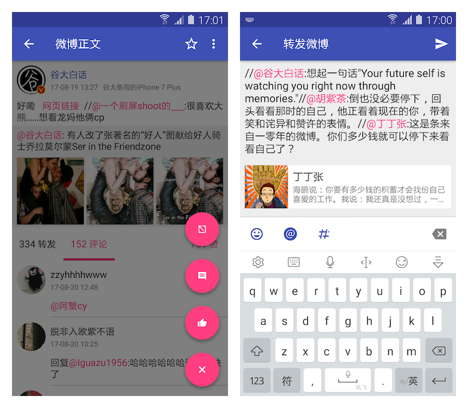

Obiew新浪微博客户端
---

Obiew是一个第三方的微博客户端，UI风格为Google在Android 5.0推出的Material Design。

### 主要功能

从微博提供的API来讲主要完成了以下的功能：

1. 获取当前登录用户及其所关注用户的最新微博
2. 获取用户的好友分组以及浏览对应分组的微博
3. 获取某一话题下的微博
3. 获取某条微博的评论列表
4. 获取某条微博的转发列表
5. 发布微博（最多9张图）
6. 评论微博
7. 转发微博

### 应用截图

